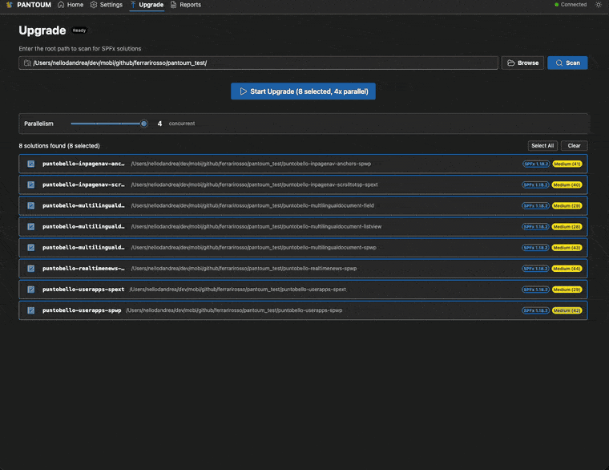

# PANTOUM

**Skip the SPFx upgrade afternoon.**

PANTOUM handles the patches, the package migrations, and the build fixes. You read the diff and ship.

[](https://opensource.org/licenses/MIT)
[](https://nodejs.org/)



> Used on the PuntoBello SPFx suite · MIT open source · Every patch and prompt is editable

## Why PANTOUM?

Upgrading SharePoint Framework solutions is a slog: the same manual cleanup every time, the same broken builds to chase, and every attempt starts over the moment something goes wrong. PANTOUM automates the upgrade, analyzes and fixes its own errors along the way, and makes every run reproducible — so you can iterate freely until the result is clean.

### The Boring Work, Done For You

For each SPFx solution, PANTOUM runs the mechanical upgrade work as deterministic steps: dependency bumps, config rewrites, script migrations, and patch application. Same inputs produce the same patch output every run, so you can tweak a setting, re-run, and compare without losing progress. If something goes sideways, the next run starts from the same known state, not a half-upgraded mess.

- Deterministic patches handle the mechanical SPFx upgrade work for you
- Same inputs produce identical patch output every run — reruns are safe
- Outputs land in `pantoum_run_{runId}/` directories you can diff against each other
- Every run writes a history entry in `pantoum_history/` so you can replay what happened

### AI Inside Guardrails

For the messy parts — PnP migrations, MGT deprecation, build errors that do not fit a deterministic patch — PANTOUM ships migration prompts and a build-fix loop that hand the work to Claude. Each AI fix is verified by re-running the build or grepping for the patterns the migration was supposed to remove. After the configured retries (default 3, configurable 1–10 via `aiMaxRetries`), if the fix has not converged, PANTOUM stops and reports what it tried — so you can analyze the result and finish the upgrade by hand.

- Migration templates for PnP JS (v1/v2/v3 → v4), Microsoft Graph Toolkit, and the gulp → Heft build system
- Each AI fix is verified by re-running the build or grepping for the patterns it was supposed to remove
- Bounded retries (default 3, configurable 1–10); after that, PANTOUM stops and hands the steering wheel back to you
- Every AI action lands as a tracked patch in the final report so you can review or revert

### Hands Off, Eyes On

PANTOUM does the work. You do the review. Every change — deterministic patches and AI fixes alike — lands as a tracked entry in a Markdown or JSON report, so you can read the whole upgrade in one sitting, attach it to a PR, or drop it into a change-control review.

- Markdown report for humans (attach to a PR), JSON report for tools (feed into CI)
- Per-solution reports show exactly what changed in each solution
- Nothing is ever "just done" — everything has a patch ID, a description, and a before/after

## Who this is for

- You run a SharePoint tenant with more SPFx solutions than you can upgrade by hand.
- You have been burned by an M365 CLI upgrade that half-worked and now your repo is in a weird state.
- You want to automate SPFx upgrades, but you also want to read every diff before you ship it.

## 60-Second Quick Start

Clone and build the repository, verify your environment, then launch Studio:

```bash
git clone https://github.com/pantoum-spfx/pantoum.git
cd pantoum
npm install
npm run build
npm run doctor
npm run webapp
```

PANTOUM Studio opens in your browser. On first launch, Studio installs its own webapp dependencies automatically — expect a short one-time delay.

Ports are centralized in `pantoum-webapp/shared/ports.json` (defaults: API `5200`, dev server `5201`).

### Optional: global `pantoum` CLI

If you want the `pantoum` command available from any directory (for scripting, CI, or terminal-first workflows), create a global symlink to your local build:

```bash
npm link
pantoum doctor
pantoum --localPath ./my-project --toVersion 1.23.0
```

PANTOUM isn't published to npm, so `npm link` is the way to expose the local build as a global command. Skip this step if you only plan to use Studio.

From there:

1. Open **Settings** and choose the main upgrade controls
2. Set your target version
3. Scan your repository from **Upgrade**
4. Run the upgrade
5. Review the output in **Reports**

## Main Settings

The onboarding path is built around a small set of settings in `pantoum.settings.yml`:

```yaml
target_version: "1.23.0"
agent_provider: "claude"
agent_model: "sonnet"
ai_fix_m365_errors: true
ai_fix_build_errors: true
ai_max_retries: 3
update_production_deps: "none"
per_solution_reports: false
```

`pantoum.patches.yml` is still supported for advanced extensibility — declarative manual steps, patch filters, version corrections, and detection patterns — but you do not need to touch it to start.

## But what about…

**Does the AI rewrite my code without asking?**
No. Every AI action lands as a tracked patch in the final report — you read the diff before you commit.

**What if Claude makes a bad fix?**
Re-run, tweak the retry count, try again. No penalty for iterating.

**What does PANTOUM handle out of the box?**
PnP JS (v1/v2/v3 → v4), Microsoft Graph Toolkit, the gulp → Heft build system, PnP companion packages, and generic build errors. AI prompts live in `src/templates/` — read, customize, extend.

**Can I customize what PANTOUM does?**
Yes — every patch, condition, and prompt lives in plain `pantoum.patches.yml` and Markdown templates. Read, override, or add your own.

**What happens when Microsoft ships a new SPFx version?**
PANTOUM does not hardcode SPFx versions — it passes your target straight to the M365 CLI and runs the result through its pipeline. The webapp's version picker is fetched from npm at runtime.

## Interfaces

Pick whichever fits your workflow — same engine underneath:

- **PANTOUM Studio** — React 19 + Fluent UI v9 webapp for solution selection, live upgrade monitoring, and report browsing
- **`pantoum` CLI** — for scripting, automation, and CI/CD pipelines
- **Claude Code plugin** — `/pantoum-upgrade`, `/pantoum-analyze`, `/pantoum-doctor`, `/pantoum-studio` slash commands

## Documentation

- [Installation](https://pantoum-spfx.github.io/pantoum/docs/getting-started/installation)
- [Quick Start](https://pantoum-spfx.github.io/pantoum/docs/getting-started/quick-start)
- [Studio](https://pantoum-spfx.github.io/pantoum/docs/user-guide/webapp)
- [Reports](https://pantoum-spfx.github.io/pantoum/docs/features/reporting)
- [How Pantoum Works](https://pantoum-spfx.github.io/pantoum/docs/architecture/overview)
- [Settings Reference](https://pantoum-spfx.github.io/pantoum/docs/user-guide/settings-reference)
- [CLI Reference](https://pantoum-spfx.github.io/pantoum/docs/user-guide/cli)

## Supported Runtime

PANTOUM currently runs on Claude only (via Claude Code subscription or `ANTHROPIC_API_KEY`). `agent_provider` is fixed to `claude`, and `agent_model` supports `sonnet` and `opus`.
